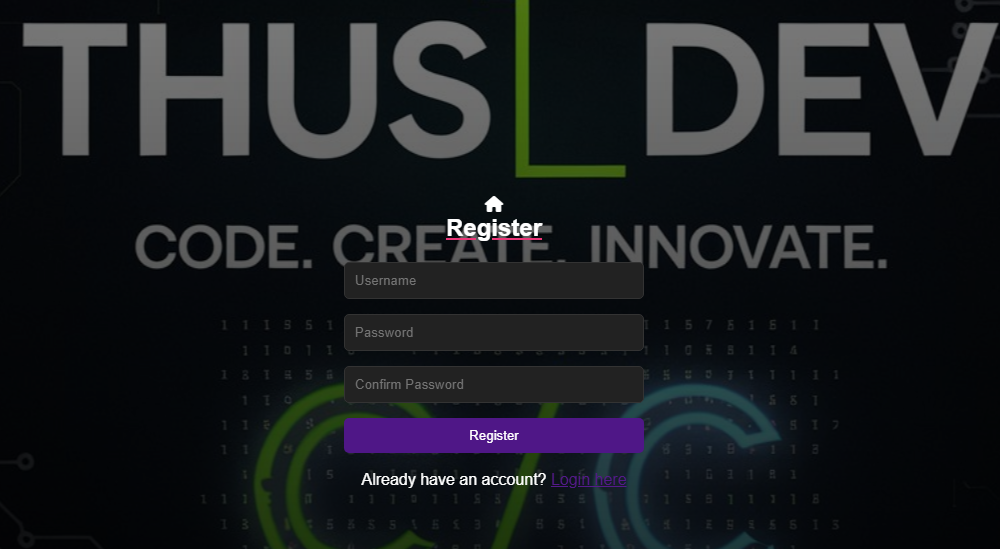
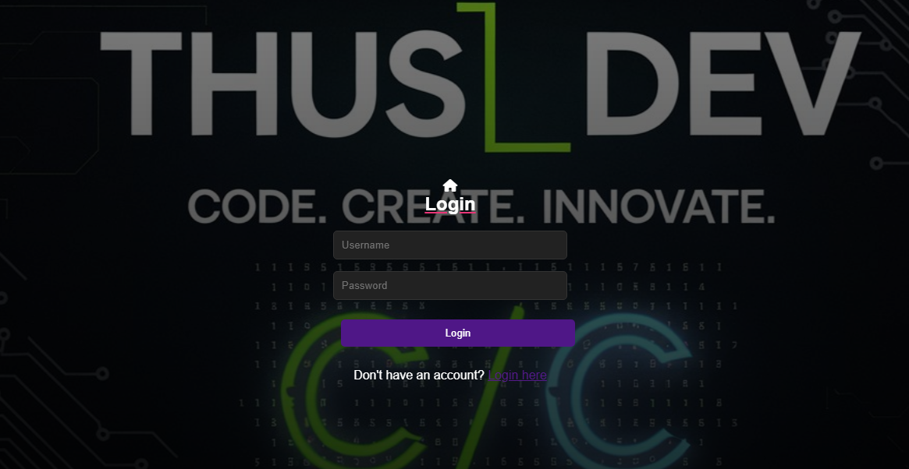
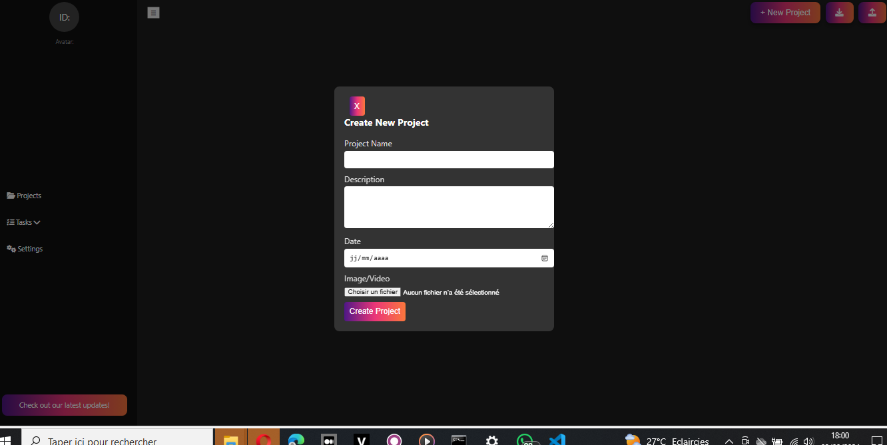
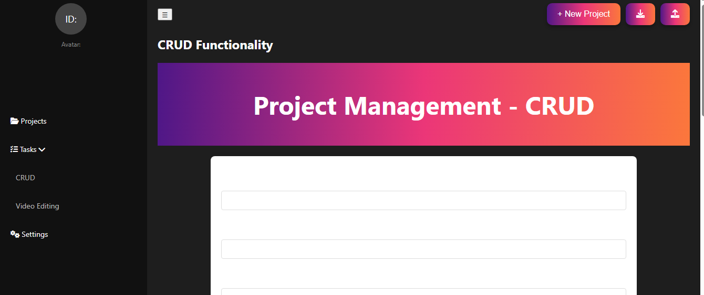
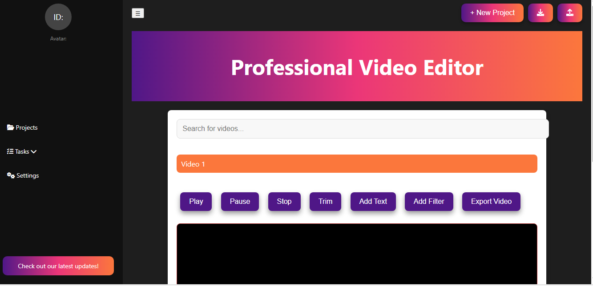

Voici le README corrigé et amélioré :

---

# Thusdash

**Thusdash** est une application de gestion de projets multimédias avec des fonctionnalités d'authentification, permettant aux utilisateurs de gérer des vidéos, d'appliquer des filtres et de créer des projets.

## Table des Matières

- [Caractéristiques](#caractéristiques)
- [Installation](#installation)
- [Utilisation](#utilisation)
- [Authentification](#authentification)
- [Captures d'Écran](#captures-décran)
- [Contribuer](#contribuer)
- [Licence](#licence)

## Caractéristiques

- **Authentification Utilisateur** : Enregistrement et connexion des utilisateurs.
- **Lecture Vidéo** : Sélectionnez et lisez des vidéos depuis une liste.
- **Édition Vidéo** : Ajoutez des superpositions de texte et appliquez des filtres.
- **Gestion de Projets** : Créez, éditez et supprimez des projets multimédias.
- **Recherche Vidéo** : Recherchez des vidéos dans la liste.
- **Exportation** : Placeholder pour l'exportation des vidéos (fonctionnalité à implémenter).

## Installation

Pour cloner et exécuter ce projet localement, suivez ces étapes :

1. **Clonez le dépôt** :

   ```bash
   git clone https://github.com/yourusername/thusdash.git
   ```

2. **Accédez au répertoire du projet** :

   ```bash
   cd thusdash
   ```

3. **Ouvrez les fichiers HTML dans votre navigateur**.

   Vous pouvez ouvrir directement les fichiers HTML dans un navigateur pour voir l'application en action. Assurez-vous que les chemins des vidéos et des autres ressources sont correctement configurés.

## Utilisation

### Authentification

1. **Inscription** :
   - Rendez-vous sur la page d'inscription (`register.html`).
   - Entrez un nom d'utilisateur, un mot de passe et confirmez le mot de passe.
   - Cliquez sur "Register" pour créer un nouveau compte.

2. **Connexion** :
   - Rendez-vous sur la page de connexion (`login.html`).
   - Entrez votre nom d'utilisateur et votre mot de passe.
   - Cliquez sur "Login" pour accéder à votre tableau de bord.

3. **Tableau de Bord** :
   - Une fois connecté, vous serez redirigé vers la page du tableau de bord (`dashboard.html`).
   - Vous pouvez visualiser et gérer vos projets multimédias depuis cette page.

### Sélectionner une Vidéo

- Cliquez sur une vidéo dans la liste pour la sélectionner.
- La vidéo se charge dans le lecteur et le canvas est mis à jour pour afficher le cadre actuel de la vidéo.

### Éditer la Vidéo

- Ajoutez du texte en utilisant le champ de saisie et cliquez sur le bouton "Ajouter Texte".
- Appliquez des filtres en sélectionnant un filtre dans la liste déroulante et cliquez sur "Ajouter Filtre".

### Gérer les Projets

- Créez un nouveau projet en remplissant le formulaire et cliquez sur "Ajouter Projet".
- Modifiez ou supprimez des projets existants depuis la liste.

### Exporter la Vidéo

- Cliquez sur le bouton "Exporter Vidéo" pour exporter le projet actuel (fonctionnalité à implémenter).

## Authentification

- **Stockage des Utilisateurs** : Les utilisateurs sont stockés dans le `localStorage` pour une gestion simplifiée des sessions. Ce stockage est utilisé pour les démonstrations et non pour une utilisation en production.
- **Sessions** : Lorsqu'un utilisateur se connecte, ses informations sont enregistrées dans le `localStorage` et sont utilisées pour afficher les données personnelles sur le tableau de bord.
- **Déconnexion** : Les utilisateurs peuvent se déconnecter en cliquant sur le bouton de déconnexion, ce qui supprime les informations de session du `localStorage`.

## Captures d'Écran

Voici quelques captures d'écran de l'application Thusdash :

### Page d'Inscription


*La page d'inscription permet aux utilisateurs de créer un compte.*

### Page de Connexion


*La page de connexion permet aux utilisateurs d'accéder à leur compte.*

### Tableau de Bord

 ( dash2.png)
*Le tableau de bord affiche les projets multimédias et permet de gérer les vidéos.*

### Gestion des Projets


*La gestion des projets permet de créer, éditer et supprimer des projets multimédias.*

### Édition de Vidéo


*L'éditeur vidéo permet d'ajouter des filtres et du texte aux vidéos.*

## Contribuer

Les contributions sont les bienvenues ! Si vous souhaitez contribuer à ce projet, veuillez suivre ces étapes :

1. **Forkez le dépôt**.
2. **Créez une branche pour votre fonctionnalité** :

   ```bash
   git checkout -b ma-nouvelle-fonctionnalité
   ```

3. **Effectuez vos modifications** et testez-les.
4. **Commitez vos modifications** :

   ```bash
   git commit -am 'Ajout de nouvelles fonctionnalités'
   ```

5. **Poussez vos modifications** :

   ```bash
   git push origin ma-nouvelle-fonctionnalité
   ```

6. **Créez une Pull Request** sur GitHub.

## Licence

Ce projet est sous la licence [MIT](LICENSE).

---

Assurez-vous de remplacer les chemins des images et les autres liens selon la structure de votre projet.